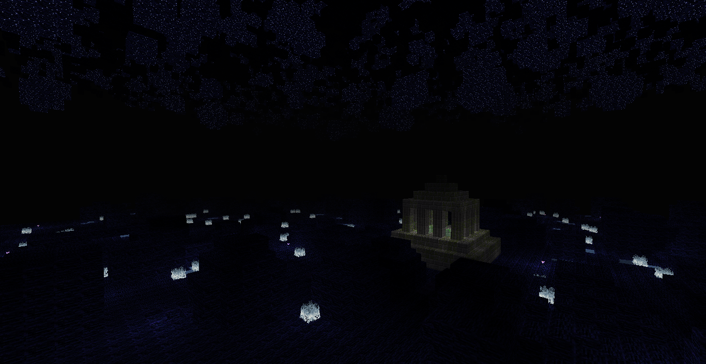

# minetest mod nssb

NSSB - Not So Simple Buildings

## information

Mod to use with [NSSM - Not So Simple Mobs](https://github.com/taikedz-mt/nssm) or [Tenplus1's NSSM](https://notabug.org/TenPlus1/nssm)

It adds buildings with monsters spawners around the world and the Morlendor dimension which can be reached by portals that spawns like the other buildings.

## Technical information

This is a continuation of NPX Team's mod made by taikedz and only provides bugfixed by users contributions.

No new features are developed yet!

### dependences:

* nssm
* tnt

### conflicts

This mod adds a dimension in the depths of the map ; as such it is incompaitble with other mapgen mods that add underground worlds such as `nether`, `fun_caves` or `caverealms`.

But is know to be the layer since -31000 so mods like `nether` can be configured to works.

### Nodes definitions

| Name Game            |  Name internal            | notes              |
| -------------------- | ------------------------- | ------------------ |
| Memoryone            | nssb:memoryone            | ·Non naturally generated ·Unbreakable        |
| Mossy Stone Brick    | nssb:mossy_stone_brick    | ·Same as Stone Brick except texture     |
| Stone Brick          | nssb:stone_brick          | ·Default Stone Brick |
| Very Mossy Stone Brick | nssb:very_mossy_stone_brick | ·Same as Mossy Stone Brick except texture  |
| Mossy Stone Column   | nssb:mossy_stone_column   | ·Same as Stone Brick except texture ·Screwdivable |
| Stone Column         | nssb:stone_column         | ·Same as Mossy Stone Column except texture |
| Seastone             | nssb:marine_stone         | ·Generated in oceans · Hard beetwen stone and bricks |
| Seastone Brick       | nssb:marine_brick         | ·Same as Seastone except texture |
| Sea Meselamp         | nssb:marine_meselamp      | ·Hard as Obsidian Glass ·Emits light level 15 |
| Morlamp              | nssb:morlamp              | ·Same as Sea Meselamp except texture |
| Mantis Clay          | nssb:mantis_clay          | ·Same as Default Stone except texture |
| Hardened Mantis Clay | nssb:hardened_mantis_clay | ·Hard as diamond ore ·Same except texture |
| Ant Stone            | nssb:ant_stone            | ·Same as Hardened Mantis Clay except texture |
| Vine                 | nssb:vine                 | ·Climbable ·Flamable · slab,Can be placed only on solid walls |
| Liana                | nssb:Liana                | ·Same as Default Ladder except texture |

### CRafting definitions

WIP

# LICENSE

* License: LGPLv2.1 or later
    * Copyright NPX Team and Contributors
* License for media: CC-BY-SA 4.0
