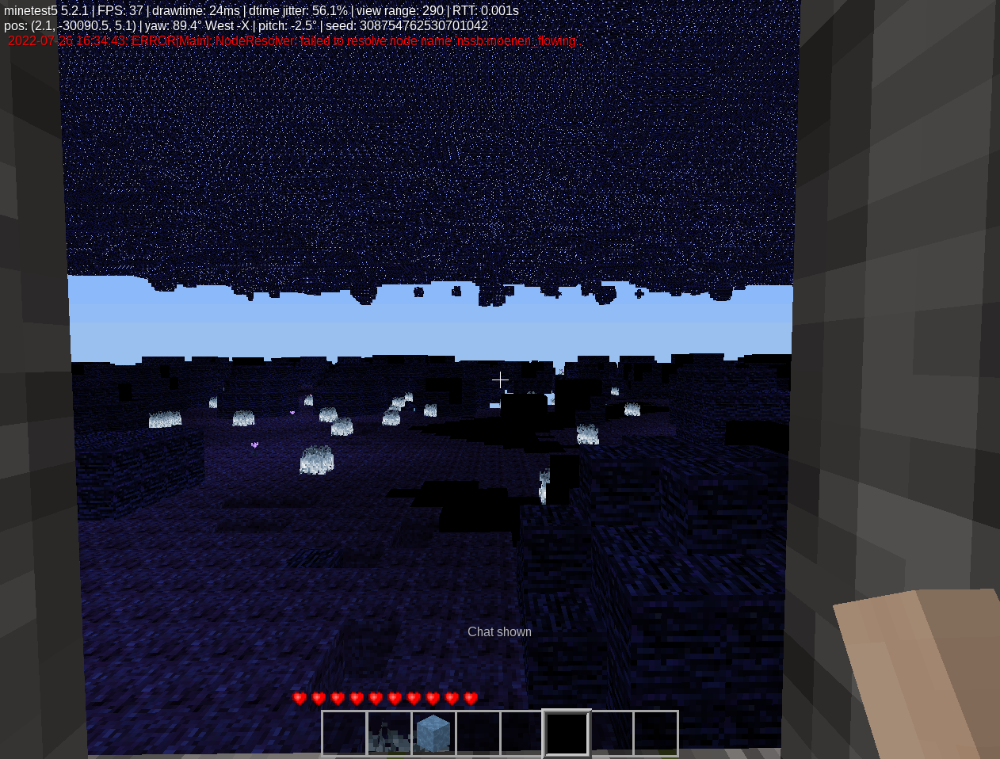

# minetest mod nssb

BIOME integration for nssm, the not so simple buildings

## information

A MAPGEN mod for Not so simple mobs (NSSM mod) that add spanners and new BIOME underground

It **add [buildings](#buildings) with monsters spanners around the world**, also
as feature **the [Morlendor](#mordenlor) dimension which can be reached by portals that spawns**
like the other buildings.

***From the portal, you have to follow the same direction of travelling from the Shire to Mordor!
Good luck!***

For usage information regarding gameplay a wiki is brewing at https://codeberg.org/minenux/minetest-mod-nssb/wiki


#### Morlendor

This is a new BIOME apart of the NSSM ones, it has a central temple where you appears, 
the mobs there will be so hostile and the nodes will be pretty rare and hard to pick.

There are many minerals (around ten new ones) and many new enemies (around six new ones).



#### Buildings

This mod provides new forms of structures for living NSSM mobs, by example will provide 
a new BIOME for each mob boos like kind event just the simple BIOME from NSSM.

There are many new structures (around 20 new) inclusive inside the already provides by the NSSM.


## Technical information

This is a **continuation of NPX Team's mod** and currently provides bugfixeds and user contributions.
**the original repo from NPXcoot and the fork from taikedz are deprecated and discontinued.**

This mod is strongly linked to the NSSM mod, and this file is minimal documentation.
No new features are developed yet! Any new contribution please mantains most backguard compatibility.

#### dependences:

* nssm
* tnt
* mobs

#### conflicts

This mod adds a dimension in the depths of the map, the [Morlendor](#mordenlor), **configurable**,
layer and in future autodetect the `nether` and `caverealms` layers to avoid conflicts.

### New buildings

This mod automatically puts in map some special structures based on enemies and biomes:

| Name game           | Name internal map   | build description biome    | frecuency    | biome |
| ------------------- | ------------------- | -------------------------- | ------------ | ----- |
| Morlendor temple    | portal              | Portal center temple       | only one     | mordenlor |
|                     | spiaggiagranchius   |                            | often        | sand  |
|                     | acquagranchius      | struture for some marine   | often        |       |
|                     | ooteca              |                            | often        |       |
|                     | minuscolaooteca     |                            | often        | grass |
|                     | piccolaooteca       |                            | often        | grass |
|                     | arcate              |                            | often        | sand  |
| Grant piramide      | grandepiramide      |                            | often        | dirt  |
|                     | collina             |                            | often        | grass |
|                     | megaformicaio       |                            | often        | grass |
| Ant Queen Hil       | antqueenhill        | antqueen trone inside ants | often        | grass |
|                     | rovine1             |                            | often        | grass |
|                     | rovine2             |                            | common       | stone |
|                     | rovine3             |                            | common       | grass |
|                     | rovine4             |                            | common       | grass |
|                     | rovine5             |                            | common       | grass |
|                     | rovine6             |                            | common       | grass |
|                     | rovine7             |                            | common       | grass |
|                     | rovine8             |                            | common       | grass |
|                     | rovine9             |                            | common       | grass |
|                     | rovine10            |                            | common       | grass |
|                     | bozzoli             |                            | common       | grass |
|                     | picco               |                            | often        | sand  |
|                     | piccoghiaccio       |                            | often        | snow  |
|                     | icehall             |                            | often        | ice   |
|                     | piccomoonheron      |                            | often        | snow  |
|                     | doppiopiccoghiaccio |                            | often        | snow  |
|                     | doppiopiccosabbia   |                            | often        | sand  |
|                     | piccoscrausics      |                            | often        | sand  |
|                     | fossasand           |                            | often        | sand  |
|                     | blocohouse          |                            | common       | stone |
|                     | bigblocohouse       |                            | common       | stone |
|                     | blocobiggesthouse   |                            | common       | stone |

### Nodes definitions

This mod uses all the nodes defined in NSSM mod, the new ones are justimproved versions 
for specific things around the new biomes and new structures:

| Name Game            |  Name internal            | notes              |
| -------------------- | ------------------------- | ------------------ |
| Morlendor Portal     | nssb:portal               | Rare, give you a way to visit Portal Morlendor center Temple |
| Portal home          | nssb:portalhome           | The liquit that powered the Portal center temple |
| Memoryone            | nssb:memoryone            | Non naturally generated ·Unbreakable        |
| Mossy Stone Brick    | nssb:mossy_stone_brick    | Same as Stone Brick except texture     |
| Stone Brick          | nssb:stone_brick          | Default Stone Brick |
| Very Mossy Stone Brick | nssb:very_mossy_stone_brick | Same as Mossy Stone Brick except texture  |
| Mossy Stone Column   | nssb:mossy_stone_column   | Same as Stone Brick except texture ·Screwdivable |
| Stone Column         | nssb:stone_column         | Same as Mossy Stone Column except texture |
| Seastone             | nssb:marine_stone         | Generated in oceans · Hard beetwen stone and bricks |
| Seastone Brick       | nssb:marine_brick         | Same as Seastone except texture |
| Sea Meselamp         | nssb:marine_meselamp      | Hard as Obsidian Glass ·Emits light level 15 |
| Morlamp              | nssb:morlamp              | Same as Sea Meselamp except texture |
| Mantis Clay          | nssb:mantis_clay          | Same as Default Stone except texture |
| Hardened Mantis Clay | nssb:hardened_mantis_clay | Hard as diamond ore ·Same except texture |
| Ant Stone            | nssb:ant_stone            | Same as Hardened Mantis Clay except texture |
| Vine                 | nssb:vine                 | Climbable ·Flamable · slab,Can be placed only on solid walls |
| Liana                | nssb:Liana                | Same as Default Ladder except texture |
| Web Cocoon           | nssb:web_cocoon           | Flamable, intrincate |
| Vertical web         | nssb:vertical_web         | Flamable, Very light web, almost liquit type|
| Web cone up          | nssb:web_cone_up          | Flamable, Very light web, almost liquit type |
| Web cone down        | nssb:web_cone_down        | Flamable, Very light web, almost liquit type |
| Dark Stone           | nssb:morentir             | Complete black, confuse and intimidate |
| Exploding Dark Stone | nssb:boum_morentir        | When mine will explodes and harm you |
| Falling Dark Stone   | nssb:fall_morentir        | Fall over you or when close |
| Dark Indistructible Stone | nssb:indistructible_morentir | The last layer .. indestructible and inperceptible |
| Dark Starred Stone   | nssb:morelentir           | Dust from the drops of DArk related nodes |
| Dark Dirt            | nssb:morkemen             | Decorative |
| Dark air             | nssb:morvilya             | Decorative, harms you no cares if there a player effect mod |
| Black Flame          | nssb:mornar               | Decorative fire black flame |
| Black Water          | nssb:mornen               | Decorative water, harms you |
| Flowing Dark Water   | nssb:mornen_flowing       | The source of dark water |
| Morlote              | nssb:morlote              | Part of morlendor biome |
| Moranga Ore          | nssb:moranga              | Ore of morlendor biome |
| Life Energy Ore      | nssb:life_energy_ore      | Ore of morlendor biome |
| Moranga Lump         | nssb:moranga_lump         | Lump of moranga ore |
| Moranga Ingot        | nssb:moranga_ingot        | Igot of maranga ore |
| Disactivated Morvalar Block | nssb:dis_morvalar_block       | Indestructible Last layer of block, but not usage posible |
| Morvalar Block       | nssb:morvalar_block       | Indestructible Last layer of block |


### Eggs definitions

This mod defines eggs for some new mosnters and few big bosses:

| Name game    | Name internal          | Produces          | notes         |
| ------------ | ---------------------- | ----------------- | ------------- |
| Ant Worker   | nssb:ant_worker_eggs   | nssb:ant_worker   | |
| Ant Soldier  | nssb:ant_soldier_eggs  | nssb:ant_soldier  | |
| Larva        | nssb:larva_eggs        | nssb:larva        | |
| Crab         | nssb:crab_eggs         | nssb:crab         | |
| Black Widow  | nssb:black_widow_eggs  | nssb:black_widow  | |
| Uloboros     | nssb:uloboros_eggs     | nssb:uloboros     | |
| Daddy Long Legs | nssb:daddy_long_legs_eggs | nssb:daddy_long_legs | |
| Xgaloctopus  | nssb:xgaloctopus_eggs  | nssb:xgaloctopus  | |
| Bloco        | nssb:bloco_eggs        | nssb:bloco        | |
| Icesnake     | nssb:icesnake_eggs     | nssb:icesnake     | |
| Snowbiter    | nssb:snow_biter_eggs   | nssb:snow_biter   | |
| Scrausics    | nssb:scrausics_eggs    | nssb:scrausics    | |
| Moonheron    | nssb:moonheron_eggs    | nssb:moonheron    | |
| Phoenix      | nssb:phoenix_eggs      | nssb:phoenix      | Flying boss |
| Tarantula    | nssb:tarantula_eggs    | nssb:tarantula    | Spider boss |
| Night Master | nssb:night_master_eggs | nssb:night_master | Dark creature boss |
| Ant Queen    | nssb:ant_queen_eggs    | nssb:ant_queen    | Ant Qeen boss |
| Icelamander  | nssb:icelamander_eggs  | nssb:icelamander  | Salamander boss |
| Giant Sandworm Egg | nssb:giant_sandworm_eggs | nssb:giant_sandworm | **The final boos egg** |


### Spawn definitions

This mod automatically will spawms some specific enemies over the map:

| monster      | nodes under    | nodes around    | moment where  | level where spawn    |
| ------------ | -------------- | --------------- | ------------- | -------------------- |
| nssm:morvy   | nssb:morentir  | nssb:morentir   | day and night | mordenlor/underground|
| nssm:morbat1 | air            | nssb:morelentir | day and night | mordenlor |
| nssm:morbat2 | air            | nssb:morelentir | day and night | mordenlor/underground|
| nssm:morbat3 | air            | nssb:morelentir | day and night | mordenlor |
| nssm:morlu   | nssb:morentir  | nssb:mornen     | day and night | mordenlor |
| nssm:morde   | nssb:morentir  | nssb:mornar     | day and night | mordenlor |
| nssm:mordain | nssb:morentir  | nssb:morentir   | day and night | mordenlor/underground|
| nssm:morgut  | nssb:morentir  | nssb:morentir   | day and night | mordenlor/underground|

### Crafting definitions

* Sea Meseamp (`nssb:marine_meselamp`)
```
{"default:glass", "bucket:bucket_water", "default:glass"},
{"default:glass", "default:mese_crystal", "default:glass"},
{"default:glass", "bucket:bucket_water", "default:glass"}
```

* Morlamp (`nssb:morlamp`)
```
{"nssm:morelentir_dust","nssm:morelentir_dust","nssm:morelentir_dust"},
{"nssm:morelentir_dust","nssm:morelentir_dust","nssm:morelentir_dust"},
{"nssm:morelentir_dust","nssm:morelentir_dust","nssm:morelentir_dust"}
```

* Moranga Ingot (`nssb:moranga_ingot`), must be cooking
```
nssb:moranga_lump",
```


# LICENSE

* License: LGPLv2.1 or later
    * Copyright 2016-2018 NPX Team and Contributors
    * Copyright 2017-2019 taikedz
    * Copyright 2021-2022 tenplus1
    * Copyright 2021-2022 PICCORO Lenz McKAY @mckaygerhard
* License for media: CC-BY-SA 4.0
    * Copyright 2016-2018 NPX Team and Contributors

Check [LICENSE.txt](LICENSE.txt)
